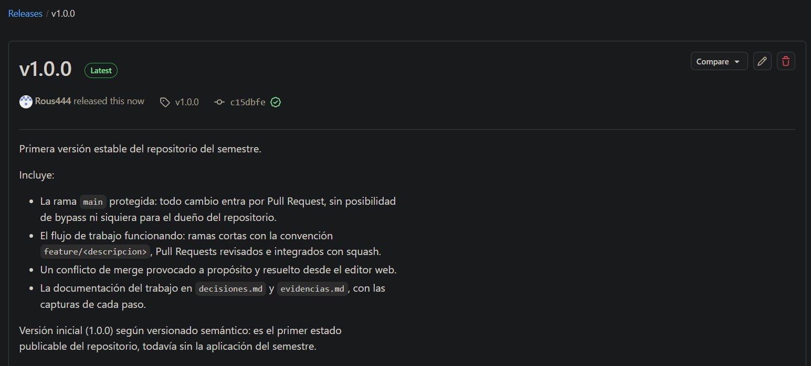
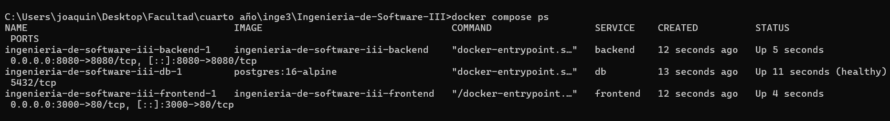
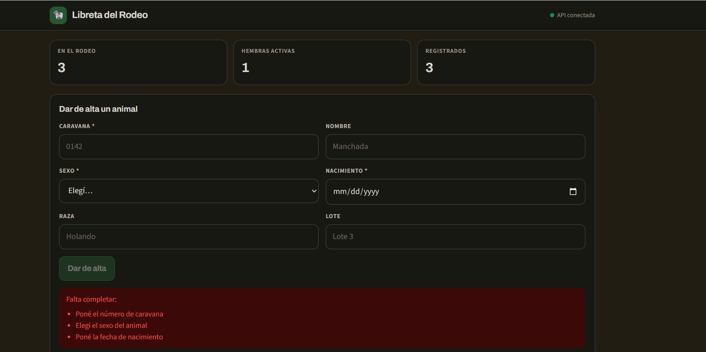
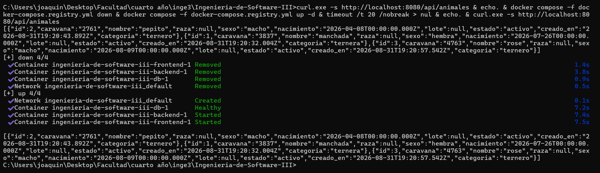
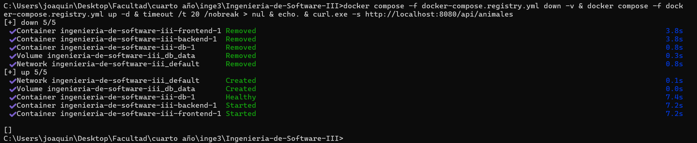
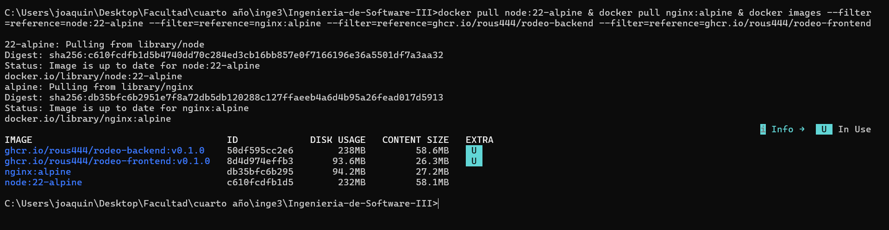
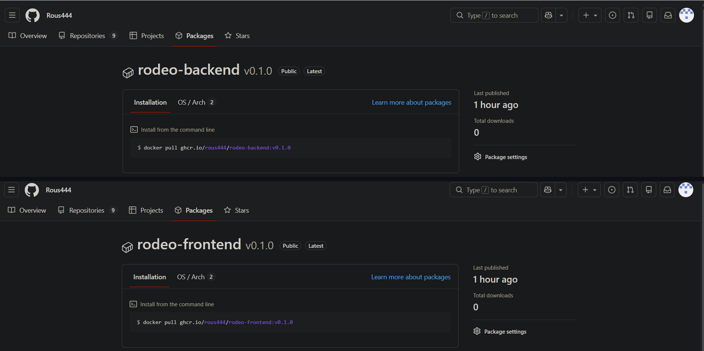
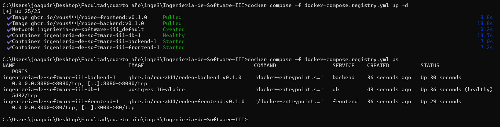

# Evidencias

## TP1 — Git colaborativo

### 1. Push directo a `main` rechazado

El rechazo lo hace GitHub desde el servidor, no mi git local: el commit se creó
bien y viajó, y la regla lo frenó al llegar (por eso el mensaje viene prefijado
con `remote:`). Como está activado *Do not allow bypassing*, la protección me
alcanza incluso a mí, que soy el creador del repositorio: ningún cambio entra a
`main` sin pasar por un Pull Request. El error es
`GH006: Protected branch update failed`.

### 2. El PR de la rama B no se puede mergear: conflicto

Después de mergear `feature/titulo-a`, el PR de `feature/titulo-b` queda
bloqueado: las dos ramas salieron de `main` y modificaron la misma línea del
README.

### 3. Los marcadores del conflicto

Arriba la versión de mi rama, abajo la que ya estaba en `main`, y `<<<<<<<`,
`=======`, `>>>>>>>` como fronteras entre las dos.

### 4. Release v1.0.0 publicada

El tag `v1.0.0` marca el commit donde cerré el TP1, y la release le agrega las
notas de qué incluye esa versión.
## TP2 — Contenedores

### 1. El sistema completo levantado con un comando

`docker compose up -d --build` levanta los tres servicios. La base figura
`healthy` gracias al `healthcheck`, y recién entonces arranca el backend por el
`condition: service_healthy`. El navegador entra por el puerto 3000 (nginx), que
reenvía `/api` al backend, y el backend habla con `db` por el nombre del servicio.

La aplicación cargando y guardando animales end-to-end: navegador → nginx →
backend → PostgreSQL.

### 2. Prueba de persistencia

Después de `docker compose down` y `up -d`, los animales siguen ahí: los
contenedores se destruyeron y se recrearon, pero el volumen `db_data` sobrevivió.

Con `docker compose down -v` la lista vuelve vacía: el flag `-v` borra también
los volúmenes. `down` apaga; `down -v` olvida.

### 3. Tamaño de la imagen final vs la imagen de build

El contraste más claro es el del frontend: la etapa de build necesita
`node:22-alpine` entero para compilar la SPA, y la imagen final es `nginx:alpine`
con los archivos estáticos encima — sin Node y sin una sola dependencia. Sin
multi-stage, la imagen de producción cargaría todo el toolchain.

### 4. Imágenes publicadas en el registry

Las dos imágenes en ghcr.io con visibilidad **Public**. Que la página diga
"Public" no alcanza como prueba: lo verifiqué haciendo `docker logout ghcr.io` y
después `docker pull`, que funcionó sin credenciales.

`docker compose -f docker-compose.registry.yml up -d` levanta el sistema
**descargando** las imágenes en vez de construirlas — se ve `Pulled` en las dos, y
en el `ps` la columna IMAGE dice `ghcr.io/rous444/...` y no el nombre de la
carpeta. Es la prueba de que el sistema se puede levantar sin tener el código.
