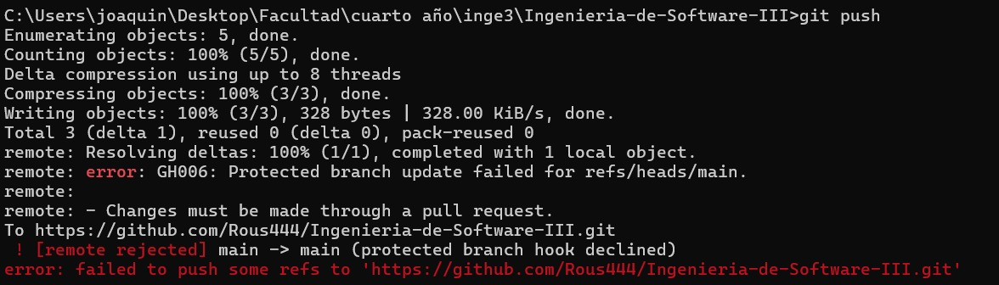
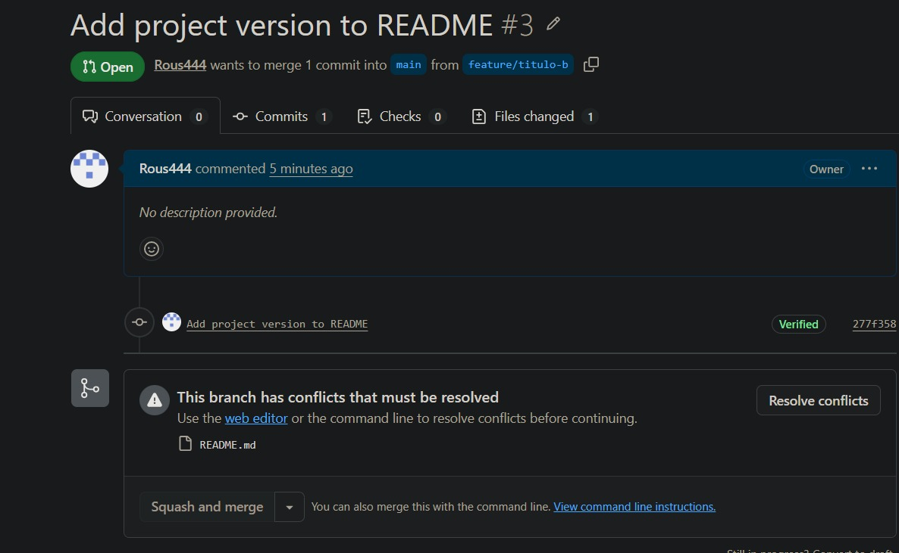
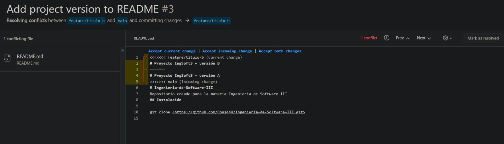

# Evidencias

## TP1 — Git colaborativo

### 1. Push directo a `main` rechazado

El rechazo lo hace GitHub desde el servidor, no mi git local: el commit se creó
bien y viajó, y la regla lo frenó al llegar (por eso el mensaje viene prefijado
con `remote:`). Como está activado *Do not allow bypassing*, la protección me
alcanza incluso a mí, que soy el creador del repositorio: ningún cambio entra a
`main` sin pasar por un Pull Request. El error es
`GH006: Protected branch update failed`.

### 2. El PR de la rama B no se puede mergear: conflicto

Después de mergear `feature/titulo-a`, el PR de `feature/titulo-b` queda
bloqueado: las dos ramas salieron de `main` y modificaron la misma línea del
README.

### 3. Los marcadores del conflicto

Arriba la versión de mi rama, abajo la que ya estaba en `main`, y `<<<<<<<`,
`=======`, `>>>>>>>` como fronteras entre las dos.

### 4. Release v1.0.0 publicada

El tag `v1.0.0` marca el commit donde cerré el TP1, y la release le agrega las
notas de qué incluye esa versión.